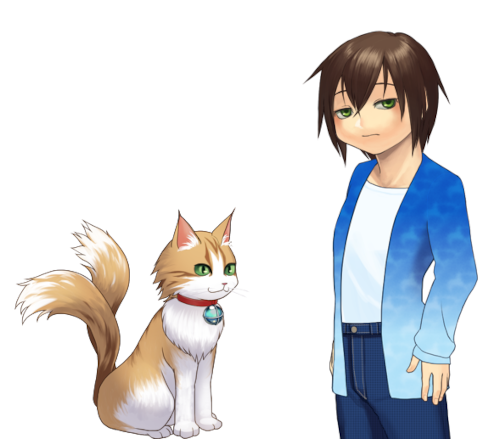
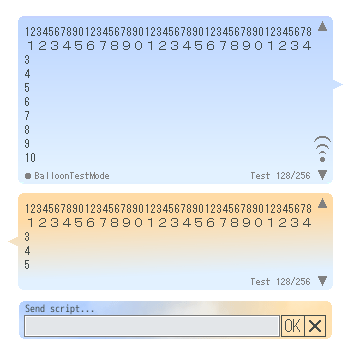

# 怠惰な佐野さん

## これは何？

伺か用ゴースト「怠惰な佐野さん」の公開レポジトリです。

ダウンロードは[Releasesの最新版](https://github.com/tukinami/taidanaSanoSan/releases/latest)から`taidanaSanoSan.nar`をどうぞ。

## ゴースト概要

面倒くさがりな少年「佐野 伊織」と、猫又の「きぬ」の雑談系ゴーストです。

満腹度によって、わずかばかりトークが増減します。
また、ユーザーがおやつをあげることもできます。

(トークの内容について、不正確な内容も含まれるかと思います。
引用等につきましては、その点ご注意下さい。)

追加シェル「master-s」(小さなドット絵シェル)、

バルーン「怠惰な猫の青い石」を同梱してます。

## 追加シェル

他の方が作成された「怠惰な佐野さん」の追加シェルです。ありがとうございます。

- [店員イチオシのコートセット](https://cherry.narnaloader.ukagaka.net/ghost.php?ghost=set_of_coats) - netai98 さん

## 関連制作物

自作の追加シェルなどです。

- [master-l](https://github.com/tukinami/taidanaSanoSan_shell_master-l) : 追加シェル。masterの全身版です。

## 二次創作の許諾の可否・ライセンスなど

[readme.txt](https://github.com/tukinami/taidanaSanoSan/blob/main/readme.txt)に記載しております。(随時更新)

## 連絡先

- [Wavebox](https://wavebox.me/wave/ersk1ec23kr3hrqr/)
- [Mastodon(fedibird)](https://fedibird.com/@tukinami_seika)
- [Mastodon(うかどん)](https://ukadon.shillest.net/@tukinami_seika)

## 製作者

月波 清火

- [GitHub](https://github.com/tukinami)
- [github.io(これまで公開した制作物)](https://tukinami.github.io)
